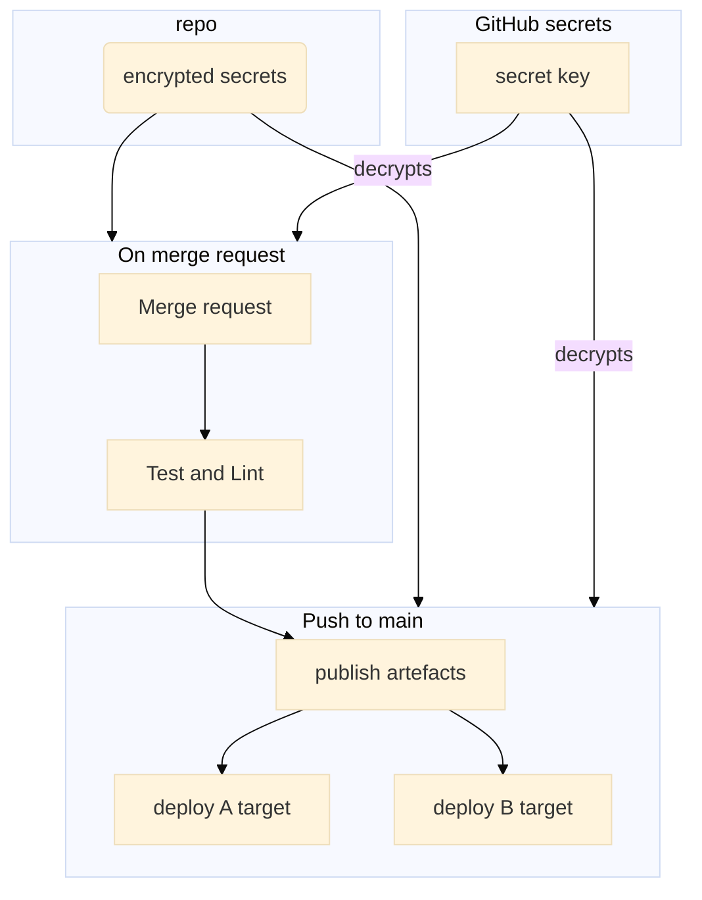

# CI/CD Absa presentation

---

## Problem statement

----

We build a feature, submitted a merge request, reviewed it, and merged. But our deploy environments are unaware of this change. Someone with access to the
deploy envs should redeploy this change manually from his local development environment. 

----

This approach has inconveniences:
1. Deployment process can take some time within which the developer is limited in productivity (imagine 5 deploy envs)
2. The repo state locally should be identical to the origin/main branch
3. Build/publish tooling compatibility (i.e. java version)
4. Secrets should be stored locally
5. Manual process, relies on humans - very bad
6. ... (many other inconveniencies)

---

## CI/CD description

---

### Old deploy process

----

#### For python projects
this is a very rough example
```bash=
$ poetry init
$ echo "$code" > my_project.py
$ rsync -avupPtz -e ssh my_project "$deploy_env":"$deploy_path"
$ ssh "$deploy_env" << EOF
virtualenv ./my_project_venv
source my_project_venv/bin/activate
cd "$deploy_path"
pip install .
EOF
```
alternatively
```bash=
$ poetry init
$ echo "$code" > my_project.py
$ poetry config repositories.jfrog "$jfrog_repo_url"
$ poetry config http-basic.jfrog "$user" "$password"
$ poetry publish --build --repository jfrog
$ ssh "$deploy_env" << EOF
virtualenv ./my_project_venv
source my_project_venv/bin/activate
pip install --index-url "$jfrog_repo_url" my_project=="$version"
EOF
```

or even develop in the deploy env

----

#### For scala projects
it is well documented here:
https://github.com/absa-group/ebds-rewards#release-process

---

### Ideal deployment process

----

Opinionated process for contributors:
```bash
git clone "$repo"
echo "$new_feature" > new_feature
git commit new_feature
git push -u origin new_feature_branch
gh pr create
echo "$address_code_review_comments" >> new_feature
git commit --amend
git push -f
```
All set. Now the feature is reviewed, merged, and deployed

----

Opinionated process for maintainers:

```bash=
# review
gh pr checkout "$mr_num"
gh pr review --comment "$mr_num"
gh pr review --approve "$mr_num"
gh pr merge --auto "$mr_num"

# CI/CD system and local development reuse the same configs
make test
make per-commit
DEPLOY_ENV=asgard make release
make publish
# etc. configs of these steps are shared, so we keep CI/CD in sync with 
#   the local environment
# Only in case of failure an email notification to be sent
```

---

### Github actions intro

Github actions (https://github.com/features/actions)

We build our new CI/CD system based on this system. 

----



```yaml
local runners:
    host within our network with access to the deploy environments
github environments:
    separated secrets namespace bound to a separate deploy env
github secrets:
    system to store secrets in the repo
```

---

## Secrets management

---

### Ideal secrets management

- Secrets access is manageable
- Secrets are stored as environment variables (source them, refer in the code)
- Secrets are managed as a code (vcs, single source)
- Secrets are hidden in logs

---

### Available solutions

Many of them, but I focus on two simplest one

----

#### github secrets (pros/cons)


----

pros:
- org level secrets (may be setup for batch repos)
- hidden in the logs
- each deploy env have own secrets namespace

cons:
- hard to setup (i.e. 10 secrets per 4 deploy envs)
- hard to keep in sync with the secrets of the local env
- wired to github

----

#### git-secret.io

[](https://asciinema.org/a/jfpvRhyOwqzXetBd3n4X2UxHA)

----

The tool uses GnuPG under the hood (https://www.gnupg.org/gph/en/manual.html)


I don't see any cons to this solution

For our CI systems, we generated a separate key which is shared across the repos

---

Now let's see the real implementation:
https://github.com/absa-group/syncwatcher-py

---

## :question: Questions :question: 

---

Thank you for your attention!

https://zhukovgreen.pro
